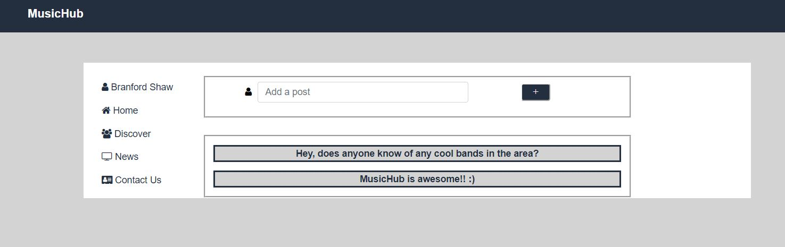
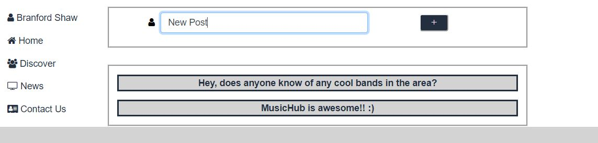
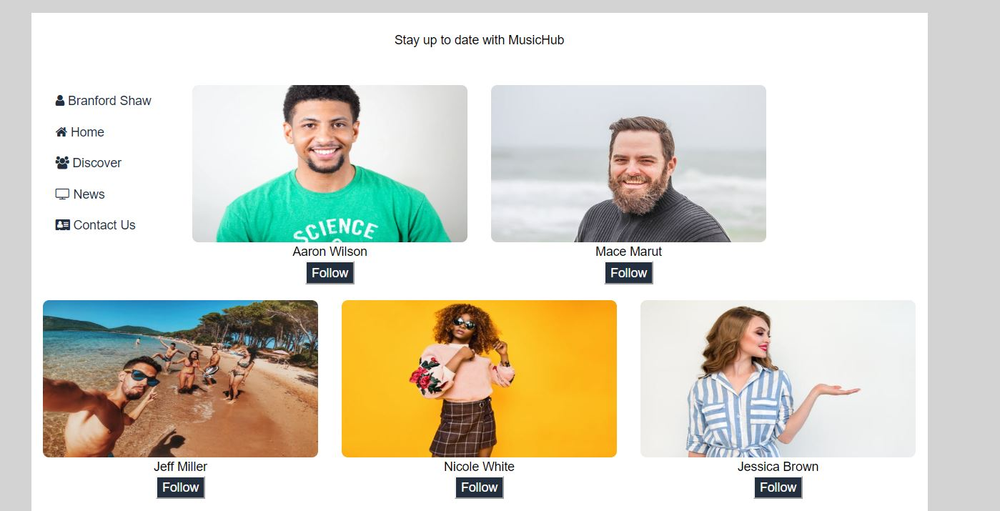
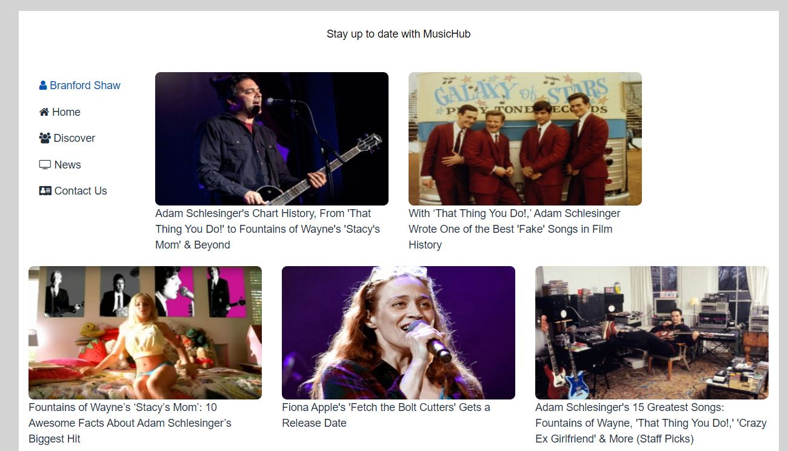

# MusicHub

### Overview

Welcome to MusicHub! MusicHub is a social media platform tailored to Musicians of all types. Big or small, a rock phenom or a jazz player we have something for you. 
The application allows users to interact with each other via a posting method found on the homepage. Our Discover page allows users to discover new connections and follow artists of their choosing. Our news page is a great way for you to stay updated with the latest news around the world. 

### How To Access:

 -- Locally

To download the application onto your own machine please use https://github.com/TomaszChylinski/MusicHub.git.

* Once cloned onto your machine, open the terminal of your choice to the following directory "MusicHub".
* Run npm install (installs all dependecies)
* In your terminal we suggest that you run our seed files "npm run seed" && "npm run discoverSeed"
* Run npm start to start the application locally
* Once complete the application should open a broswer and take you to the homepage.

-- Online

Please visit www.heroku.com (https://lychee-tart-99833.herokuapp.com/)

# Logging In
    * For testing purposes please use the following
        - email: testing@musichub.com
        - password: review123

    * Once logged in the homepage should render for the user

# Creating a post

* To create a new post the user has to input text into the input field, to submit please press enter or click the "+" button.

# Connecting to artists

* To connect to a fellow artist please click on the "Discover" button found on the left hand side of the page. Once clicked the discover page should render. Click on the "Follow" button to add start following.

# Getting the latest news

* To get the latest news please click on the "News" button found on the left hand side of the page. Once clicked the news page should render. A user is able to click on any article of their choice.

Thank you for viewing my MusicHub application for any question please feel free to visit my portfolio to contact me <a href="https://tomaszchylinski.github.io/chylinski-tomasz-portfolio/index.html">page</a>